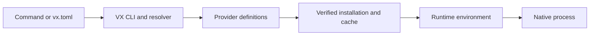

<picture>
  <source media="(prefers-color-scheme: dark)" srcset="https://raw.githubusercontent.com/vx-org/.github/main/profile/assets/vx-symbol-dark.svg">
  
</picture>

# VX

Run the commands you know, with the runtime versions your project needs.

```console
vx node@22 --version
vx uv run python app.py
vx cargo build --release
```

## Why VX exists

A project often needs several language runtimes, build systems and command-line
utilities. Installing each with a different manager, keeping PATH consistent,
and reproducing a teammate's environment takes time before useful work begins.

VX provides one entry point. Prefix a command with `vx`; it resolves the requested
runtime version, installs it when needed, prepares its environment, and forwards
your arguments. Project requirements live in `vx.toml`, so local development,
CI and agent sessions can start from the same declaration.

## What it solves

- **Version drift:** select a version in the command or declare it for the project.
- **Setup friction:** let Providers describe acquisition and installation.
- **Environment conflicts:** prepare the runtime environment for each command.
- **Automation overhead:** use the same command form in terminals, CI and MCP configuration.

VX is a transparent command proxy. Existing runtime commands keep their arguments
and behavior; Providers define installation and execution details.

## Architecture



The Rust workspace separates the CLI, orchestration, runtime management and
foundation layers. Providers use Starlark descriptors; lower layers handle
versions, paths, downloads and process execution.

The package distribution work adds a shared boundary for larger application
environments: per-runtime repositories publish verified Rez packages; a thin
adapter uses the Rez Next SDK for repository discovery, dependency solving,
variants and environment actions; VX owns acquisition, caching and execution.
This integration is being validated. Availability must be checked separately
for each published SDK, package version and native platform.

## Get started

Start with the [installation and first commands](https://loonghao.github.io/vx/guide/getting-started),
then declare your project requirements in
[vx.toml](https://loonghao.github.io/vx/config/vx-toml).

```console
vx setup
vx dev
```

Read the [documentation](https://loonghao.github.io/vx/), explore
[Providers](https://github.com/loonghao/vx/tree/main/crates/vx-providers), or
[contribute a Provider](https://loonghao.github.io/vx/guide/creating-provider).
The main repository is preparing to move into this organization; the links
above remain on the current live repository and documentation site.

## Ecosystem

| Repository | Responsibility |
| --- | --- |
| [VX](https://github.com/loonghao/vx) | Runtime resolution, installation, cache and command execution. |
| [Rez Next](https://github.com/loonghao/rez-next) | Shared package, repository, dependency solver and environment semantics. |
| [vx-rez-adapter](https://github.com/vx-org/vx-rez-adapter) | Thin integration boundary between VX and the Rez Next SDK. |
| [vx-rez-packages](https://github.com/vx-org/vx-rez-packages) | Shared package builder, schema, native validation and release tooling. |
| [witr](https://github.com/vx-org/witr) | First real runtime package repository; upstream provenance, licenses and six native target recipes. |
| [mirrors](https://github.com/vx-org/mirrors) | Existing upstream binary archive and synchronization tooling. |

Each runtime package repository must identify its upstream source and license,
retain legal notices, declare supported platforms, and publish versioned assets
with mandatory SHA-256 checksums. Native validation and release assets establish
availability; source code alone does not.

Upstream projects retain their ownership, licenses and support commitments.
Redistribution follows each runtime's license and corresponding source obligations.

## Contribute

Report runtime resolution or execution issues in
[VX](https://github.com/loonghao/vx/issues). Report SDK, adapter or bundle issues
in the repository that owns them, including the version, platform, command and
diagnostic output. Never include tokens or other credentials.

---

VX 希望减少开发开始前的环境准备成本。项目需要的语言运行时、构建系统和命令行程序，
可以通过一个 `vx` 入口选择版本、安装并执行；团队将共同要求写进 `vx.toml`。

架构上，VX 负责运行时获取、缓存和执行，Provider 描述安装方式；正在验证的包分发链路
复用 Rez Next 的仓库、依赖求解、变体和环境语义。组织内每个实际运行时包仓库保留上游来源、
许可证与校验摘要。请以对应版本的公开 Release 和原生平台验证结果判断可用性。
